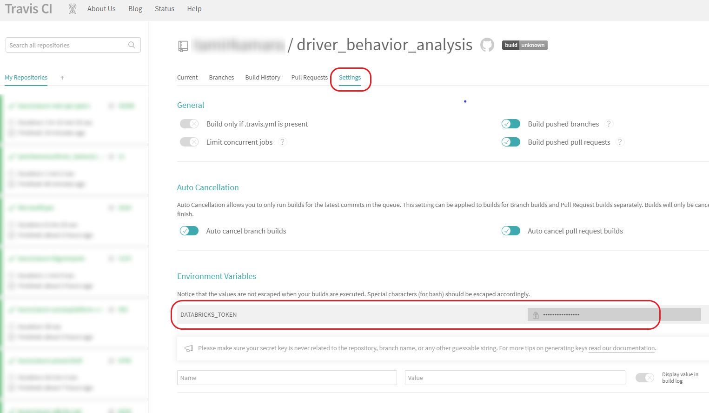

# Driver behavior analysis
This code repository holds the jupyter notebooks for estimating driver safety on Pointer's dataset, as well as the deployment scripts for deployment on Azure.

It contains a sample of the dataset as well as Python (pandas) and PySpark implementations of the process.
This is an experimental project.

A code story describing this solution can be found in: https://www.microsoft.com/developerblog/2018/07/30/unsupervised-driver-safety-estimation-at-scale/

It's best first to go over the python notebook as it contains more details, and then to the pyspark notebook to see the same implementation on pyspark.

### Notebooks:
- Python: https://github.com/Microsoft/driver_safety_analysis/blob/master/Driver%20safety%20estimation%20-%20pandas.ipynb

- PySpark: https://github.com/Microsoft/driver_safety_analysis/blob/master/Driver%20safety%20estimation%20-%20pyspark.ipynb

### Requirements
- For the python notebook:
  - Python > 3.5
  - **packages**: numpy (1.14.0 and above), scipy, pandas, seaborn, matplotlib

- For PySpark:
  - Python > 3.5
  - **packages**: numpy (1.14.0 and above), scipy, pandas, seaborn, matplotlib, pyspark

### Deployment
When deploying this sample solution you should take note of a few resources provided in the repository:

- databricks/deploy
  - 0_azure - an interactive, one-time script that configures your local environment and azure resources to run this solution. It will create a Databricks cluster on azure, install its cli locally on your machine and guide you through the initial configuration.
  - 1_configure - Databricks job deployment script and sample job definition file. These resources are intended to be used multiple times, possiblly in an automated way, i.e. in a continues deployment pipeline (CD - see more below).
    - The shell script can be used interactively and in batch. 
    It requires the job definition location or pattern (to iterate over). It can also use parameters for the Databricks region and access token - these are most likely required in for CD as those need to be configured on every run.
    - The json file specify settings for creating a new job on Databricks. Things like: name, cluster, notebook location, library dependencies, schedule, etc.
- databricks/notebooks - a sample python notebook to be run on a Databricks cluster
- .travis.yml - an example of how to configure a CI/CD pipeline on [Travis-CI](https://www.travis-ci.org)

#### How to use Travis-CI
The example travis.yml file performs the following actions:
- Install the Databricks CLI
- Deploy to Databricks environment from the master branch (by default) by running the deploy_job.sh script described above.
This action is using a special environment variable $DATABRICKS_TOKEN that is injected from Travis-CI where it's saved securely. 
The following image shows where and how this is defined on the configuration screen:

Note: currently the "test" phase isn't doing much since this can be very specific to the notebook code, Databricks and additional resources related (file storage, event sources, etc.). 

### License
MIT

# Contributing

This project welcomes contributions and suggestions.  Most contributions require you to agree to a
Contributor License Agreement (CLA) declaring that you have the right to, and actually do, grant us
the rights to use your contribution. For details, visit https://cla.microsoft.com.

When you submit a pull request, a CLA-bot will automatically determine whether you need to provide
a CLA and decorate the PR appropriately (e.g., label, comment). Simply follow the instructions
provided by the bot. You will only need to do this once across all repos using our CLA.

This project has adopted the [Microsoft Open Source Code of Conduct](https://opensource.microsoft.com/codeofconduct/).
For more information see the [Code of Conduct FAQ](https://opensource.microsoft.com/codeofconduct/faq/) or
contact [opencode@microsoft.com](mailto:opencode@microsoft.com) with any additional questions or comments.
